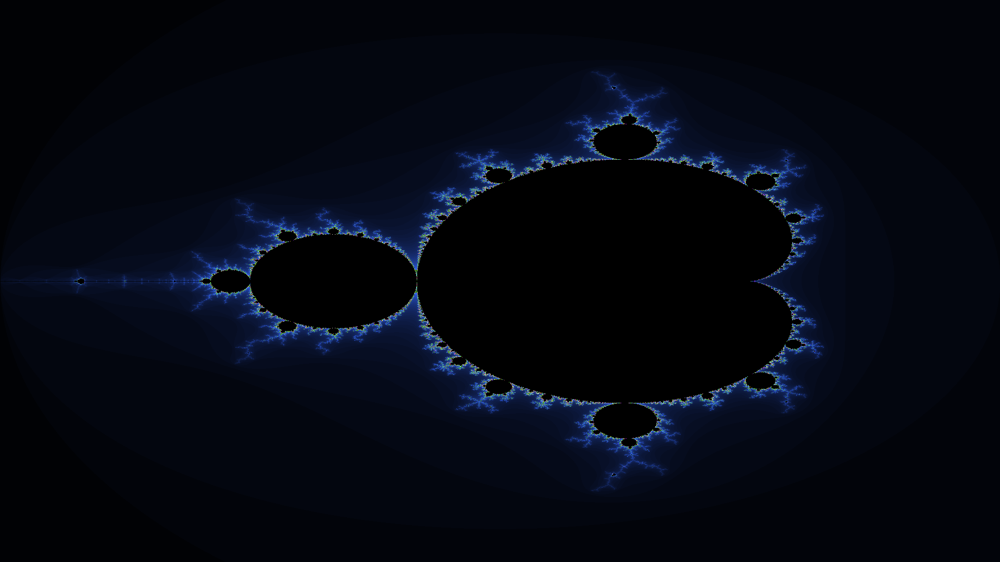

# Mandelbrot of Madness

## Implementasi Serial
Pertama program akan menerima input untuk resolusi dari gambar mandelbrot nanti.
Selanjutnya nested loop digunakan untuk setiap pixel (x,y), lalu koordinatnya dipetakan titik bilangan kompleks (cx, cy).
Titik kompleks c ini kemudian diproses oleh fungsi getMandelbrotIterations, yang menjalankan iterasi z = z² + c.
Nilai iterasi yang dihasilkan kemudian diteruskan ke fungsi mapIterationToColor untuk menentukan warna.
Untuk Iterasi max pixelnya akan berwarna hitam dan sisanya akan mengikuti gradasi warnanya.


## Impelementasi Paralal
Kurang lebih cara kerjanya sama seperti serial, tetapi implementasi paralel akan membagi nested loop pertama menjadi beberapa bagian thread sehingga progmram akan berjalan lebih cepat. Threadding dilakukan dengan OpenMP

V
## Run Program
Untuk menjalankan program serial dapat menggunakan  ```./run_serial.sh```

Untuk menjalankan program paralel dapat menggunakan ```./run_paralel.sh```

## Benchmark
Benchmark menggunakan resolusi 1920x1080 untuk masing masing implementasi. Waktu perbandingan yang diberikan dalam satuan detik

| Serial  | Paralel |
| ------------- | ------------- |
| 1.183952 | 0.355336  |


## Gambar Fraktal

